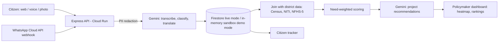

<p align="center">
  <picture>
    <source media="(prefers-color-scheme: dark)" srcset="public/brand/nagarvaani-logo-dark.svg">
    
  </picture>
</p>

<p align="center"><b>Every citizen's voice. Every city's priority.</b></p>

<p align="center">
  <a href="https://github.com/rohilkohli/NagarVaani/actions/workflows/ci.yml"></a>
</p>

**NagarVaani** is a multilingual AI platform that turns citizen complaints (voice, text, photo, WhatsApp) into
need-weighted infrastructure priorities for policymakers. Built for **Build with AI: Code for Communities, Second Edition**
(Google Cloud x Hack2skill), **Track 01: AI for Digital Public Infrastructure & Governance**, with "solving for India"
as the theme and BRICS applicability as an extension.

| | |
|---|---|
| **Live demo** | https://nagarvaani-636001394004.asia-south1.run.app (no login, sandbox data) |
| **Demo video** | [Watch the demo](VIDEO_URL_HERE) |
| **Submission notes** | [docs/SUBMISSION.md](docs/SUBMISSION.md) |

---

## The problem

The Track 01 brief describes it well: citizen development requests live in fragmented systems, which leads to
misaligned public spending, unaddressed infrastructure gaps, and no way to measure the impact of digital public
infrastructure. Citizens speak dozens of languages and use voice and messaging apps, not forms.

## What NagarVaani does

1. **Collects** complaints in the citizen's own language: web form, voice (Gemini transcription, with a confirm-and-edit step),
   photo, and a WhatsApp Cloud API webhook.
2. **Understands** each complaint with Gemini: detects the language, translates to English, classifies the category
   (roads, water, electricity, sanitation, health, education, other) and scores urgency 1 to 5. PII is redacted before any Gemini call.
   If Gemini is unavailable, a rule-based classifier takes over and every result is tagged with `classified_by` and a confidence level.
3. **Deduplicates** near-identical reports by text, category, district and location (`lib/duplicate.ts`).
4. **Joins complaints with national data** (Census 2011 population and literacy, NITI Aayog aspirational-district flag,
   NFHS-5 household indicators) and computes a **need-weighted priority score** so a small, under-served district can outrank a large city
   with more raw complaints. The dashboard shows raw rank versus need-weighted rank side by side.
5. **Recommends projects**: Gemini receives the aggregated, data-joined table (not raw complaints) and returns structured
   recommendations with evidence, beneficiaries derived from Census population, a relevant scheme only when appropriate,
   and "insufficient data" instead of guesses. A deterministic builder is the fallback, tagged `rule-based`.
6. **Shows it** on a demand heatmap (Google Maps + deck.gl), priority rankings, department views and a citizen-facing tracker.

## Architecture



## Tech stack

| Layer | Technology |
|---|---|
| Frontend | React 19, Vite, TypeScript, Tailwind CSS v4 |
| Backend | Express (`server.ts`), served from a single Cloud Run container |
| AI | Google Gemini via `@google/genai` (default `gemini-2.5-flash`, override with `GEMINI_MODEL`) |
| Data | Firebase Firestore and Storage (live mode); in-memory sandbox (demo mode) |
| Maps | Google Maps JavaScript API + deck.gl HeatmapLayer |
| Messaging | WhatsApp Cloud API webhook with HMAC signature verification |
| Deploy | Cloud Run (asia-south1), Cloud Build source deploy |

## Two run modes

| | Demo (`APP_MODE=demo`) | Live |
|---|---|---|
| Login | none | Firebase Auth, roles: admin, supervisor, operator, auditor |
| Storage | in-memory sandbox seeded with synthetic data | Firestore and Storage |
| Admin actions | disabled | enabled by role |
| Needs | only `GEMINI_API_KEY` (falls back to rule-based without it) | Firebase, secrets, Meta setup for WhatsApp |

## Data and provenance

- `data/districts.csv`: 58 districts. Census 2011 population and literacy, NITI Aayog aspirational-district flag.
  NFHS-5 (2019-21) electricity, improved drinking water and improved sanitation are loaded for **30 of 58 districts**
  (mirror repository covers 21 states and UTs); the rest are left empty on purpose, never estimated.
  `pmgsy_road_connectivity_pct` is not loaded.
- Sources, licences and retrieval dates: [data/SOURCES.md](data/SOURCES.md). Row-level trace: [data/VERIFICATION.md](data/VERIFICATION.md)
  (human verification is still pending).
- **Need-weighted score** = complaints per 100k population x mean urgency x (1 + deprivation factor) x unresolved-age factor.
  Weights are configurable constants in [`lib/priority.ts`](lib/priority.ts) and shown in the dashboard tooltip.
  Beneficiary estimates use configurable assumed shares of district population per category; they are estimates, not scheme data.
- Seed complaints (`lib/seedData.ts`) are **synthetic** (66 records: 56 in India, 10 across other BRICS countries) and labelled as demo data in the UI.

## Evaluation

`npm run eval` runs the classifier on a 60-complaint synthetic multilingual set (10 Indian languages x 6 complaints)
and writes [docs/eval-results.md](docs/eval-results.md). The committed report covers the **rule-based fallback only**;
Gemini has not been evaluated in that report because no API key was available when it was generated.
The set is synthetic and small, so treat the numbers as a regression check, not as model accuracy.

## Quick start

```bash
git clone https://github.com/rohilkohli/NagarVaani.git
cd NagarVaani
npm install
cp .env.example .env
# credential-free demo:
APP_MODE=demo NODE_ENV=development GEMINI_API_KEY=demo-key npm run dev
```

Open http://localhost:3000. On Windows PowerShell use `$env:APP_MODE="demo"; $env:NODE_ENV="development"; $env:GEMINI_API_KEY="demo-key"; npm run dev`.

Checks used by CI:

```bash
npm run check:env && npm run lint && npm test && npm run build
npm run smoke -- http://localhost:3000        # API smoke test against a running server
npm run test:e2e                              # Playwright browser smoke test
```

## Environment variables

| Variable | Purpose |
|---|---|
| `GEMINI_API_KEY` | Gemini access (Secret Manager on Cloud Run) |
| `GEMINI_MODEL` | Optional model override; `npm run check:model` lists what your key supports |
| `APP_MODE` | `demo` for the sandbox; anything else is live mode |
| `GOOGLE_MAPS_API_KEY` | Injected at runtime through `/config.js` (no rebuild needed). Restrict by HTTP referrer |
| `VITE_FIREBASE_*` | Firebase web config (live mode) |
| `FIREBASE_SERVICE_ACCOUNT_JSON`, `ADMIN_SESSION_SECRET`, `INTERNAL_JOB_KEY` | Live-mode secrets |
| `META_APP_SECRET`, `WHATSAPP_*`, `GRAPH_API_VERSION` | WhatsApp Cloud API |
| `PII_REDACTION_ENABLED`, `RETENTION_DAYS` | Privacy controls |
| `DEMO_GEMINI_DAILY_CAP` | Daily Gemini call cap for the public demo (default 500) |
| `ENABLE_TTS` | Optional text-to-speech playback of tracking status (off by default) |

Google Maps setup: enable **Maps JavaScript API**, create a key restricted to your site's exact URL, and set it on Cloud Run:

```bash
gcloud run services update nagarvaani --region asia-south1 --update-env-vars GOOGLE_MAPS_API_KEY=<key>
```

## Deploy to Cloud Run (demo mode)

From Cloud Shell in your project (billing enabled):

```bash
gcloud services enable run.googleapis.com cloudbuild.googleapis.com artifactregistry.googleapis.com secretmanager.googleapis.com
echo -n "<GEMINI_KEY>" | gcloud secrets create GEMINI_API_KEY --data-file=- --replication-policy=automatic
# grant the runtime service account roles/secretmanager.secretAccessor on that secret, then:
gcloud run deploy nagarvaani --source . --region asia-south1 --allow-unauthenticated \
  --memory 1Gi --cpu 1 --cpu-boost --min-instances 0 --max-instances 1 \
  --set-env-vars "NODE_ENV=production,APP_MODE=demo,GOOGLE_MAPS_API_KEY=<maps key>" \
  --set-secrets GEMINI_API_KEY=GEMINI_API_KEY:latest
```

`--max-instances 1` is required because the demo sandbox and the WhatsApp idempotency cache are per instance.
Full steps and troubleshooting: [setup-guide.md](setup-guide.md).

## WhatsApp setup (live mode)

Create a Meta Business app with the WhatsApp product, set the webhook to `{CLOUD_RUN_URL}/api/whatsapp/webhook`
with your verify token, subscribe to `messages`, and set `WHATSAPP_PHONE_NUMBER_ID`, `WHATSAPP_ACCESS_TOKEN` and `META_APP_SECRET`.
Requests are rejected unless the `X-Hub-Signature-256` HMAC matches; media downloads are limited to Meta hosts, 16 MB and an allowlist
of MIME types. Test locally without Meta using `npx tsx scripts/simulate-whatsapp.ts`. The integration has been exercised with
signed simulated payloads and unit tests, not yet with a live Meta account.

## Security and privacy

- PII patterns (phone, email, ID-like numbers) are redacted before Gemini requests and before persistence of WhatsApp content.
- Staff access uses Firebase Google sign-in plus Firestore role records; sessions are short-lived; status changes are audit-logged.
- Per-IP rate limits, request size limits and a daily Gemini cap protect the public demo; the retention job is internal-only.
- Accessibility prompt on first visit: larger text, high contrast, reduced motion.

## Evaluation criteria alignment

| Criterion (weight) | Where it shows up |
|---|---|
| AI/Technical Execution (25%) | Gemini transcription, classification with schema-validated JSON, translation, urgency, recommendations; PII redaction; fallbacks tagged honestly; 39 unit tests, Playwright smoke test, CI (`lib/gemini.ts`, `lib/classify.ts`, `lib/transcribe.ts`, `lib/priority.ts`) |
| Problem-Solution Fit (20%) | Voice, text, photo and WhatsApp intake, multilingual, aggregated hotspots and ranked project recommendations for policymakers |
| Depth & Reach Across India (20%) | 10 Indian languages plus English (17 UI languages), 56 Indian seed records across 20+ states, Census/NITI/NFHS-5 district data layer |
| Deployability & Scalability (20%) | Single Cloud Run container, demo and live modes, health and ready endpoints, CI, source-deploy guide |
| Impact Potential (15%) | Need-weighted ranking surfaces under-served districts that raw complaint counts hide |

## Limitations and next steps

- Demo data is synthetic; the public demo runs a per-instance in-memory sandbox.
- NFHS-5 indicators cover 30 of 58 districts; Census values await human verification.
- Gemini classification accuracy has not been measured on real complaints.
- WhatsApp needs a Meta Business account and has not been tested live; idempotency is per instance (use Firestore or a queue for multi-instance).
- Next: complete national data coverage, live-mode pilot with Firebase, real complaint evaluation, DPDP Act 2023 compliance review, load testing.

## Repository layout

```
server.ts        Express API and static hosting
lib/             Server modules and their tests (classify, gemini, priority, whatsapp, ...)
components/      React UI (citizen, dashboard, shared)
src/             Vite entry, App.tsx, pages
data/            District data, sources, eval set
docs/            Eval results, submission notes, brand kit
scripts/         check-env, check-model, eval, smoke, WhatsApp simulator, NFHS import
public/          Static assets, icons, brand logos
```

Brand assets live in [docs/brand](docs/brand). Licence and data terms: see [data/SOURCES.md](data/SOURCES.md).
